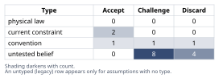
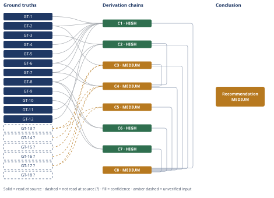

# Switching from CSV to CSA Mid-Project

*First-principles analysis · 2 October 2026*

## Executive Summary

**Recommendation:** Do not switch the whole project now, and keep every executed CSV record. Use a documented hybrid, with CSA for the remaining work, only if your SOPs permit it, Part 11 and supplier readiness are confirmed, and enough not-high-risk scripted work remains to pay for the change. Otherwise finish under CSV and adopt CSA at the first post-release change control (chain C8).

**Band (from §6):** MEDIUM (chain C8).

**Would change it:** Reading your SOP or Validation Master Plan (chain C3). Counting the remaining not-high-risk cases and timing your own test cases (chains C4, C5). Confirming whether the system falls under 21 CFR 820 (chain C3).

## 1. Problem Essence

**Core problem:** For a device production or quality-system software project that is already part-executed under a traditional Computer System Validation (CSV) plan, which way of doing the remaining assurance work gives risk-proportionate assurance an inspector will accept, with the least rework? The candidates are CSV throughout, Computer Software Assurance (CSA) throughout, a split between them, or CSV now and CSA from a later lifecycle point. The analysis must also name the conditions that decide between them.

What triggered the question was a team proposal to "go to the new way" and the user's sense that this is a bad move. That trigger is not the question. The question is how the remaining work should be allocated, and which observable conditions about this project and this firm decide that allocation.

**Success criteria:**

- The Conclusion states whether the user's premise that CSA is "less rigorous" or "less defensible" holds, and why.
- The Conclusion states whether testing already executed under CSV must be re-executed if the method changes.
- The Conclusion states what a method change means for 21 CFR Part 11 obligations.
- The Conclusion names at least one split or combined option and says whether it beats both pure options.
- The Conclusion gives a recommendation tied to named, checkable gating conditions, not a bare preference.
- The Conclusion names the evidence that would change the recommendation.

## 2. Assumptions Table



| Assumption | Type | Treatment | Verdict | Verification |
|------------|------|-----------|---------|--------------|
| A-1: CSA is less rigorous than CSV | untested belief | Verify, or flag as unverified | Discard — the guidance scales rigour up for high process risk (scripted or hybrid) and down only for features that are not high risk; proportionality is now required (C1) | GT-5, GT-6, GT-7, read at source |
| A-2: CSA records are less defensible in an FDA inspection | untested belief | Verify, or flag as unverified | Challenge — FDA authored and finalised the approach (GT-1) and lists what the record must contain (GT-8). Defensibility depends on the firm's own procedures and on record quality, not on the method's name (C3) | GT-1, GT-8 read; firm procedures are GT-14? — unverified — flagged |
| A-3: Switching method mid-project means re-executing the tests already done | untested belief | Verify, or flag as unverified | Discard — the guidance has no transition or re-execution clause, and a scripted record already holds every CSA record element except the per-feature risk analysis (C2) | GT-8, GT-11, read at source |
| A-4: After the QMSR, CSV is still the "more compliant" choice | convention | Explicitly challenge before use | Challenge — the QMSR removed 820.70 and incorporates ISO 13485, whose validation clauses require effort proportionate to risk (GT-4, GT-5). CSV remains an acceptable alternative (GT-2), but it is not more compliant by definition | GT-2, GT-4, GT-5, read at source |
| A-5: The choice is binary, CSV or CSA | convention | Explicitly challenge before use | Discard — the guidance itself describes hybrid scripted plus unscripted testing (GT-7), and the options can be split by feature and by lifecycle point (C4) | GT-7, read at source |
| A-6: The firm's SOPs and Validation Master Plan already permit risk-based or unscripted assurance | untested belief | Verify, or flag as unverified | Challenge — not supplied; this is a gate on any switch (C3) | unverified — flagged (GT-14?) |
| A-7: The team can do process-risk classification and unscripted testing well | untested belief | Verify, or flag as unverified | Challenge — not supplied; it drives the execution-risk scores (C4) | unverified — flagged (GT-16?) |
| A-8: The system is device production or quality-system software under 21 CFR 820 | current constraint | Record expiry conditions | Accept — expires if the system serves drug or biologic GMP under 21 CFR 211 or 600 instead; the guidance is a CDRH/CBER device guidance (GT-12), and outside that scope CSA applies only by analogy | GT-12 read; the user's domain is GT-18? — unverified — flagged |
| A-9: Moving to CSA relaxes or changes Part 11 obligations | untested belief | Verify, or flag as unverified | Discard — the guidance sends Part 11 questions to the Part 11 Scope and Application guidance and treats Part 820 documents kept electronically as electronic records (C6) | GT-9, read at source |
| A-10: Vendor documentation can replace the firm's own testing | current constraint | Record expiry conditions | Accept — holds only once a documented, risk-based supplier evaluation under purchasing controls is on file; it lapses for any vendor without one (C7) | GT-10, read at source |
| A-11: The Sept 2025 final guidance is the current reference | untested belief | Verify, or flag as unverified | Discard — it was superseded by the version issued 3 Feb 2026, retitled "Production and Quality Management System Software" (GT-1) | GT-1, read at source |
| A-12: Switching saves more schedule than it costs | untested belief | Verify, or flag as unverified | Challenge — this depends on how much unexecuted, not-high-risk scripted work remains, set against a fixed transition cost (C5) | unverified — flagged (GT-13?, GT-17?) |
| A-13: Inspectors judge the project against the firm's own approved procedures and plan | untested belief | Verify, or flag as unverified | Challenge — consistent with ISO 13485's documented-procedure requirements, but that standard was not opened in this analysis (C3) | unverified — flagged (GT-15?) |
| A-14: The decision to change method needs its own documented rationale under change control | convention | Explicitly challenge before use | Accept — survives challenge because the change amends an approved validation plan (C3), and an undocumented amendment is a deviation whatever method is chosen | rests on C3, whose inputs include GT-15? — unverified — flagged |
| A-15: The 1–5 scores in the trade-off fit a typical project in mid-execution | untested belief | Verify, or flag as unverified | Challenge — surfaced by the Assumption Audit on C4. Priced on C4: the flip test and the O3 fallback absorb a score change | unverified — flagged |
| A-16: No outside commitment fixes the validation method (quality agreement, regulatory commitment, consent decree, submission content) | untested belief | Verify, or flag as unverified | Challenge — surfaced by the Assumption Audit on C8. If such a commitment exists, it is a further gate of the same kind as C3 | unverified — flagged |
| A-17: The current validation plan prescribes scripted testing for the remaining cases | untested belief | Verify, or flag as unverified | Challenge — surfaced by the Assumption Audit on C3. If the plan already permits risk-based testing, the deviation hop weakens and the gate is easier to pass | unverified — flagged |

## 3. Ground Truths

Unless stated otherwise, the source is FDA, *Computer Software Assurance for Production and Quality Management System Software*, final guidance, document issued 3 February 2026 (fda.gov/media/188844/download, docket FDA-2022-D-0795). This analysis downloaded it and read it in full text. Page numbers are the printed page numbers.

- **GT-1** The current final CSA guidance was issued on 3 February 2026 and supersedes the final guidance issued on 24 September 2025. Its title now reads "Production and Quality *Management* System Software". Source: FDA guidance (above). Read-at-source: cover page — "Document issued on February 3, 2026. This document supersedes 'Computer Software Assurance for Production and Quality System Software,' issued September 24, 2025."; corroborated on the fda.gov guidance landing page (Final, February 2026).
- **GT-2** The guidance is nonbinding, and an alternative approach is acceptable if it satisfies the applicable statutes and regulations. Source: FDA guidance. Read-at-source: Introduction, p. 1 — "not binding on FDA or the public. You can use an alternative approach if it satisfies the requirements of the applicable statutes and regulations."
- **GT-3** The guidance supplements *General Principles of Software Validation* and supersedes only that document's Section 6 (Validation of Automated Process Equipment and Quality System Software). Source: FDA guidance. Read-at-source: Introduction, p. 2 — "except this guidance supersedes Section 6: Validation of Automated Process Equipment and Quality System Software".
- **GT-4** The amended Part 820 (QMSR) took effect on 2 February 2026. It removed most of the former requirements, 21 CFR 820.70 included, and incorporates ISO 13485:2016 by reference. Source: FDA guidance, footnote 3 (citing 89 FR 7496). Read-at-source: footnote 3, p. 2 — "This final rule took effect on February 2, 2026. This rule removed the majority of the current requirements in Part 820, including 21 CFR 820.70, and instead incorporates by reference ... ISO 13485".
- **GT-5** Under ISO 13485 Subclauses 4.1.6, 7.5.6 and 7.6, as the guidance states them, software validation and revalidation must be proportionate to the risk of the software's use. Source: FDA guidance. Read-at-source: Scope section, p. 7 — "the specific approach and activities associated with software validation and revalidation are required to be proportionate to the risk associated with the use of the software".
- **GT-6** A software feature, function or operation is high process risk when its failure "may result in a quality problem that foreseeably compromises safety". The guidance presents risk in binary form: high process risk or not high process risk. Source: FDA guidance. Read-at-source: Section V.A.2 (identifying risk), pp. 9–10 — the definition quoted, and "FDA is presenting the process risks in a binary manner".
- **GT-7** For high-process-risk features, manufacturers "may choose to consider more rigor such as the use of scripted testing or a hybrid approach". For features that are not high risk, unscripted methods may be used (scenario, error-guessing, exploratory). The examples are "not exclusive to those categories". Source: FDA guidance. Read-at-source: Section V.A.4 (determining assurance activities), p. 14.
- **GT-8** The recommended record contains: intended use; the result of the risk-based analysis; a description of the testing; issues found; a conclusion statement; who performed the work and when; and review and approval where appropriate. The record "need not include more evidence than necessary". FDA recommends digital records such as "system logs, audit trails" as evidence. Source: FDA guidance. Read-at-source: Section V.A.6, "Establishing the Appropriate Record", p. 17.
- **GT-9** Manufacturers are directed to the Part 11 Scope and Application guidance. A document required under Part 820 and kept in electronic form "would generally be an 'electronic record' under Part 11". Source: FDA guidance. Read-at-source: Section B, "Considerations for Electronic Records Requirements", p. 21.
- **GT-10** FDA recommends a risk-based evaluation of software vendors under purchasing controls. For supporting software, assurance "may be sufficiently established by leveraging vendor evaluation and validation records", so that further testing "may be unnecessary". Source: FDA guidance. Read-at-source: Section V.A.5, p. 16.
- **GT-11** The guidance contains no transition provision and no instruction to re-execute or revalidate systems already validated under a prior approach. Source: FDA guidance, full text. Read-at-source: a full-text search for "transition", "legacy", "retrospective", "re-validat" and "revalidat" found no transition clause. The only "revalidation" hit is the proportionality sentence quoted in GT-5. This is an absence finding over the whole document.
- **GT-12** The guidance is issued by CDRH and CBER. It addresses software used as part of device production or the quality management system under Part 820. Source: FDA guidance. Read-at-source: cover page (issuing centers), and Introduction and Scope (Part 820 and ISO 13485 framing).
- **GT-13?** The project's state is not known: what fraction of testing is already executed, the process-risk mix of the remaining features, and how many unexecuted scripted cases remain. Unverified: not supplied by the user.
- **GT-14?** It is not known whether the firm's SOPs and Validation Master Plan permit risk-based, unscripted assurance. Unverified: not supplied by the user.
- **GT-15?** Inspectors assess conformance to the manufacturer's own documented procedures and approved plans, so executing outside an approved plan is an observable nonconformity (ISO 13485:2016 Subclauses 4.1 and 4.2 require documented procedures). Unverified. Phase 3 failure record: ISO 13485:2016 (iso.org Online Browsing Platform) returned HTTP 403 Forbidden (paywalled), so it was not opened.
- **GT-16?** It is not known whether the team is competent at process-risk classification and unscripted testing. Unverified: not supplied by the user.
- **GT-17?** Effort figures. A scripted test case for a not-high-risk feature takes about 4–8 hours to author, execute and review. An unscripted case with its record takes about 1–2 hours. The fixed cost of switching mid-project (plan amendment, per-feature risk analysis, training) is about 80–240 hours, excluding any SOP revision. Unverified: these are estimates, not measured values, and no first-principles source exists. The user should replace them with figures timed on this project.
- **GT-18?** It is not known whether the user's system is device software (21 CFR 820) or drug or biologic GMP software (21 CFR 211 or 600). Outside device scope, CSA applies only by analogy. Unverified: the user said only "FDA-regulated".

**Provenance summary:**

```text
?-marked: GT-13?, GT-14?, GT-15?, GT-16?, GT-17?, GT-18? (6 of 18)
Read-at-source: GT-1 cover page and landing page; GT-2 Intro p.1; GT-3 Intro p.2; GT-4 fn.3 p.2;
GT-5 Scope p.7; GT-6 §V.A.2 pp.9-10; GT-7 §V.A.4 p.14; GT-8 §V.A.6 p.17; GT-9 §B Electronic Records p.21;
GT-10 §V.A.5 p.16; GT-11 full-text absence search; GT-12 cover and Intro
Phase 3 failure record: GT-15? — ISO 13485:2016, iso.org OBP, HTTP 403 (paywall)
```

The figures in the user's context were checked. The Sept 2022 draft and the Sept 2025 final are both correct as history, but the Sept 2025 final is no longer current (GT-1). The QMSR effective date of February 2026 is correct (GT-4). The statement that Part 11 is unchanged is consistent with GT-9.

## 4. Derivation Chains



### The permutations compared

These are the options the chains below compare. Each is the user's named permutation, made precise.

| ID | Option | What happens to executed evidence | What happens to the remaining work |
|----|--------|-----------------------------------|------------------------------------|
| O0 | Finish under CSV (status quo) | Kept as is | Scripted, under the current plan |
| O1 | Switch fully now | Re-planned under CSA: re-classified, and possibly re-documented or re-executed | CSA |
| O2 | Hybrid (composite) | Kept, with a bridging per-feature risk-analysis record added | CSA under an amended validation plan: scripted or hybrid for high-risk features, unscripted for the rest |
| O3 | Finish under CSV, then CSA at change control (composite over time) | Kept as is | Scripted until release; every post-release change assessed under CSA |

### Risk register by permutation (input to C4)

The categories are the ones the user named. Each cell gives the main exposure and the ground truth or chain behind it.

| Risk category | O0 Finish CSV | O1 Switch fully now | O2 Hybrid | O3 CSV then CSA at change control |
|---|---|---|---|---|
| Regulatory or inspection | Low. One governing plan; CSV remains acceptable (GT-2) | High. A re-planned package shows its executed history under an approach it no longer follows (C3) | Medium-low if the plan amendment and rationale exist before execution (C3); high if they do not | Low (GT-2) |
| Documentation coherence and traceability | High coherence | Lowest. Two generations of traceability for the same requirements | Medium. Two record styles, bridged by one amendment and a per-feature risk table (C2) | High for the release; the change-control records are CSA-native |
| Rework | Highest remaining effort on not-high-risk features (GT-7, GT-17?) | Highest overall. Re-planning executed work that C2 shows remains valid | Lowest, if material not-high-risk scope remains (C5) | As O0 until release, lower afterwards |
| Team competence (risk-based and unscripted testing) | None needed | Fully exposed (GT-16?) | Exposed only on not-high-risk features, where a miss costs least (GT-6, GT-7) | Learned on smaller post-release changes |
| QMS procedure readiness | None needed | Gate (C3, GT-14?) | Gate (C3, GT-14?) | Needed only by the first post-release change |
| Vendor or supplier assurance | Unchanged | Testing reductions need a supplier file (C7) | Testing reductions need a supplier file (C7) | Needed later (C7) |
| Audit trail of the decision rationale | Not needed | Required (C3) | Required (C3) | Required once, at the procedure level |
| Schedule and cost | Predictable and higher | Unpredictable | Lowest, if the breakeven in C5 is met | Predictable now, savings later |
| Part 11 | Unchanged (C6) | Unchanged; audit-trail integrity becomes evidence (C6) | Same as O1 for the unscripted portion (C6) | Unchanged now (C6) |

### Conclusion C1: CSA is FDA's current, risk-proportionate expectation for device production and QMS software, not a lowered bar

GT-1 (final guidance, 3 Feb 2026) + GT-2 (nonbinding; alternatives allowed) + GT-4 (QMSR effective 2 Feb 2026) + GT-5 (validation proportionate to risk, required) + GT-6 (high process risk definition) + GT-7 (scripted or hybrid for high risk) + GT-12 (device scope)
→ under the QMSR, matching validation effort to risk is a requirement of the incorporated standard, not an optional guidance choice
→ the guidance asks for more rigour, scripted or hybrid testing, on features whose failure foreseeably compromises safety, and less on the rest
→ CSA moves assurance effort according to risk instead of cutting it across the board
→ for device production and QMS software, the belief that CSA is less rigorous or less defensible than CSV is false as a property of the method
→ any loss of rigour under CSA would therefore come from how a team carries it out, not from the method

**Confidence:** HIGH. Every head input was read at source in the 3 Feb 2026 guidance, and each hop follows from the quoted text by deduction. The strongest rival, "CSA is inherently weaker because inspectors expect scripted evidence", is ruled out in §5 (Dead End: CSA is inherently the weaker method) by GT-7 and GT-2. Its execution-risk form is a different claim, carried on C4 and in the adversarial pass. The scope limit (GT-12) is part of the endpoint itself: "for device production and QMS software".

### Conclusion C2: Testing already executed under CSV stays valid; a switch needs only an added risk-analysis record, not re-execution

GT-3 (supersedes only GPSV Section 6) + GT-8 (CSA record elements) + GT-11 (no transition or re-execution clause)
→ a scripted test record already holds the test description, the issues found, the conclusion, who did it, the date and the approval that the CSA record lists
→ the only CSA record element a CSV package is not certain to contain is a documented risk-analysis result for each feature
→ the guidance does not require testing already performed to be repeated
→ executed CSV evidence can be carried forward unchanged
→ moving the remaining work to CSA therefore needs a per-feature risk-analysis record, not a redo

**Confidence:** HIGH. The inputs were read at source. Hop 1 compares the GT-8 list item by item against the contents of a scripted record, and hop 3 is the absence finding in GT-11. The rival, "a package with two methods is incoherent and the executed part must be brought into line", is ruled out in §5 (Dead End: Switching requires re-executing completed tests) by GT-8 and GT-11.

### Conclusion C3: The real limit on a mid-project switch is the firm's own procedures and plan, so a switch is allowed only as a documented change with its rationale recorded

GT-2 (guidance nonbinding) + GT-14? (SOP readiness unknown) + GT-15? (inspectors assess conformance to own procedures)
→ because the guidance creates no obligation, this project is inspected against the firm's own approved validation plan and SOPs
→ running unscripted CSA-style testing under a plan that prescribes scripted testing is a deviation from an approved document *[Assumes: A-17 — the current plan prescribes scripted testing for the remaining cases]*
→ a switch is allowed only after the SOPs permit risk-based assurance and the validation plan has been amended under change control with the rationale recorded
→ SOP and plan readiness is a gate on the switch, not a criterion to weigh against schedule

**Confidence:** MEDIUM. The Inputs axis is short, and both shortfalls are named:

- **GT-14?** Read the firm's current SOP and Validation Master Plan for language permitting risk-based or unscripted assurance; that read settles it.
- **GT-15?** Reading ISO 13485:2016 Subclauses 4.1 and 4.2, or the firm's own last inspection observations, would remove it. ISO 13485 was unreachable here (HTTP 403).

The [Assumes: A-17] premise is priced. If the current plan already permits risk-based testing, hop 2 weakens, but the endpoint still stands, because the gate is then simply already passed. No rival is live: the competing reading, "the guidance alone authorises the team to switch", is the claim hop 1 rules out by GT-2.

### Conclusion C4: Among the permutations, the documented hybrid (O2) scores highest, conditional on the C3 gate and on material remaining scope; otherwise the CSV-then-CSA path (O3)

GT-6 (high process risk definition) + GT-7 (risk-scaled testing) + GT-13? (remaining scope unknown) + GT-16? (team competence unknown) + GT-17? (effort estimates) + C2 (executed evidence carries) + C3 (SOP gate)
→ O1 is dominated, since it pays to re-plan executed evidence that C2 shows remains valid
→ with weights locked before scoring, the totals are O2 84, O3 76, O0 75, O1 57, driven by assurance focus (weight 5) and remaining rework (weight 4) *[Assumes: A-15 — the 1–5 scores fit a typical project in mid-execution]*
→ no single weight change flips O2; the nearest, assurance-focus weight 5 to 1, only ties O2 with O3 at 64
→ the scores that put O2 first depend on material not-high-risk scope remaining (GT-13?) and on the team's competence being adequate (GT-16?)
→ recommend O2 when the C3 gate is passed and material unexecuted not-high-risk scope remains, and O3 otherwise
→[2nd] actor lens: QA reviewers and inspectors meet two record styles in one package, so the package needs one bridging rationale they can be pointed to
→[2nd] actor lens: management may read CSA as a cost cut and press for features to be reclassified downward, which works against the risk-proportionate aim
→[3rd] time lens: unless the bridging rationale is filed with it, the hybrid package becomes a one-off legacy artefact that every later inspection asks about
→[3rd] time lens: once CSA governs change control, every later change to this system is assessed under CSA whichever option is chosen now, so the method question returns at the first change

**Confidence:** MEDIUM. The Inputs axis is short:

- **GT-13?** An inventory of the remaining unexecuted test cases, each tagged high or not-high process risk, would remove it.
- **GT-16?** A dry run of five to ten unscripted not-high-risk cases, reviewed by QA against GT-8's record list, would remove it.
- **GT-17?** Timing three scripted and three unscripted cases on this project would remove it.
- **C3** is rated MEDIUM, and its own line explains why.

The [Assumes: A-15] premise is priced. The flip test shows the winner survives every single weight move. A score change caused by small remaining scope lowers O2's rework score, and that case is exactly the endpoint's O3 branch, so the endpoint stands. The second-order effect "management presses to reclassify features downward" contradicts no ground truth, but it works against the success aim. It is carried as a weak link with a plan change: QA independently approves the per-feature risk classifications. The rival "O0 is best because coherence comes first" is ruled out in §5 (Dead End: Finish everything under CSV unconditionally).

The adversarial pass named two more weak links on this chain. Cluster K-A, risk classification captured by schedule pressure, is met by a plan change: QA approves every classification. Cluster K-C, thin or untraceable unscripted records, is met by a plan change: every unscripted record carries every GT-8 element, and the trace matrix records each feature's risk class and method.

### Conclusion C5: Whether to switch the remaining work comes down to a breakeven between remaining not-high-risk scripted cases and a fixed transition cost

GT-17? (effort estimates) + GT-13? (remaining scope unknown)
→ target quantity is net hours saved, equal to N remaining not-high-risk cases times the saving per case, minus the fixed transition cost
→ a saving of 3–6 hours per case (scripted 4–8 h less unscripted 1–2 h) against a fixed cost of 80–240 hours puts breakeven N between about 13 and 80 cases
→ with fewer than about 15 such cases left the switch cannot pay back, and above about 80 it pays back at either end of the bracket
→ if the SOP itself must be revised first, the fixed cost grows by an amount outside the project's control and breakeven rises past any plausible remaining scope

**Confidence:** MEDIUM. The Inputs axis is short, and both inputs close by the same verification:

- **GT-17?** Timing three scripted and three unscripted cases on this project, and costing the plan amendment, would remove it.
- **GT-13?** The remaining-scope inventory described under C4 would remove it.

The formula and the direction of each threshold follow by arithmetic, and the arithmetic recomputes: 80/6 ≈ 13, and 240/3 = 80. Only the bracket values are estimates. No rival conclusion competes with a breakeven identity.

### Conclusion C6: Part 11 obligations do not change under any option, and CSA makes the system's own audit trail part of the validation evidence

GT-8 (digital records and audit trails as evidence) + GT-9 (Part 11 applies to Part 820 electronic records)
→ choosing CSV or CSA changes how assurance evidence is produced, not which records count as electronic records under Part 11
→ CSA's least-burdensome preference for system logs and audit trails as test evidence makes those records part of the validation record
→ Part 11 controls (audit trail, electronic signatures, access) must be assured under every option
→ under CSA the audit trail's integrity must be assured before it is relied on as evidence

**Confidence:** HIGH. Both inputs were read at source, and each hop is deduction from the quoted text. The endpoint rules out the rival "CSA relaxes Part 11" (§5, Dead End: Part 11 relaxes under CSA).

### Conclusion C7: Using vendor evidence to drop remaining tests is open to a mid-project switch only once a documented supplier evaluation is on file

GT-10 (vendor evaluation and leverage) + GT-8 (record elements)
→ vendor evidence can stand in for the firm's own testing only through a documented, risk-based supplier evaluation under purchasing controls
→ a mid-project switch cannot claim that reduction unless the supplier file already holds the evaluation and the vendor's validation records
→ before any remaining test is dropped on the strength of vendor evidence, the supplier evaluation must be on file and referenced in the amended plan

**Confidence:** HIGH. Both inputs were read at source, and each hop is deduction. The endpoint is itself a ruling-out: vendor evidence is not a free substitute. That does the rival's work.

### Conclusion C8: The user is right to oppose a wholesale switch and wrong to oppose CSA; the decision comes down to two gates and one sizing test

C1 (CSA not weaker) + C2 (executed evidence carries) + C3 (SOP gate) + C4 (O2 conditional, else O3) + C5 (breakeven) + C6 (Part 11 unchanged) + C7 (supplier file)
→ the user's instinct against a wholesale switch is right, because a full re-plan buys nothing that C2 does not already keep
→ the user's premise that CSA is weaker is wrong, so the instinct should not extend to refusing CSA for the remaining work
→ the decision comes down to a procedure gate (C3), a readiness gate covering the Part 11 audit trail and the supplier file (C6, C7), and the breakeven sizing in C5 *[Assumes: A-16 — no outside commitment fixes the validation method]*
→ run the documented hybrid if both gates pass and the breakeven is met, and otherwise finish under CSV and adopt CSA at the first post-release change control

**Confidence:** MEDIUM. The Inputs axis is short through C3, C4 and C5, all rated MEDIUM; their own lines carry the verification. The [Assumes: A-16] premise is priced: an outside commitment that fixes the method would be a further gate of the same kind as C3, and its failure sends the decision to the endpoint's fallback branch, so the endpoint stands. Rivals are answered in §5 (Dead Ends: Finish everything under CSV unconditionally; Switching requires re-executing completed tests).

## 5. Abandoned Reasoning

### Dead End: CSA is inherently the weaker method

**What was tried:** We took the user's premise at face value: CSA trades rigour for speed, so an inspector will treat a CSA record as weaker evidence than a scripted CSV record.

**Why abandoned:** It contradicts the regulatory text. GT-7 directs scripted or hybrid testing at high-process-risk features. GT-5 makes proportionality a requirement under the incorporated ISO 13485 clauses. GT-2 confirms that the guidance states FDA's current thinking on how to meet the regulation. CSA is less work on features that are not high risk and the same or more work on features that are, so "weaker" is not a property of the method.

**What it ruled out:** Any recommendation that rests on CSA being less defensible as such. The real exposure is in execution, such as misclassifying risk or keeping thin records, and that sits on C4 and in the adversarial pass.

### Dead End: Switching requires re-executing completed tests

**What was tried:** We assumed a method change resets the validation package, so that executed scripted protocols would have to be re-planned or re-run under CSA. This assumption is what makes O1 so expensive.

**Why abandoned:** GT-11 (an absence finding over the full guidance text) shows no transition or re-execution requirement. GT-8's record elements are already present in a scripted record, except the per-feature risk analysis (C2).

**What it ruled out:** O1 as a sensible choice, and the idea that a two-method package must be brought into line by redoing the executed part. A bridging record is sufficient.

### Dead End: Finish everything under CSV unconditionally

**What was tried:** We treated O0 as the safe default whatever the remaining scope, on the grounds that one method gives the most coherent record.

**Why abandoned:** Coherence is real, and it is scored at weight 5 in C4. But C2 shows that the hybrid keeps the executed evidence intact, and with weights locked before scoring, O0 still scores below both O2 and O3 (75 against 84 and 76). It also builds no CSA capability before the first post-release change, and C4's 3rd-order effect shows CSA will govern that change anyway.

**What it ruled out:** "Finish under CSV" as an unconditional answer. It survives only as part of O3, and only when the C3 gate or the C5 breakeven fails.

### Dead End: Anchoring on the September 2025 guidance

**What was tried:** The user's context named the September 2025 final guidance as the reference.

**Why abandoned:** GT-1. That version was superseded on 3 February 2026 by "Computer Software Assurance for Production and Quality Management System Software", which is aligned to the QMSR (GT-4).

**What it ruled out:** Citing the superseded document in the validation plan amendment or the SOP. Any procedure written against the 2025 text should be checked against the 2026 text.

### Dead End: Part 11 relaxes under CSA

**What was tried:** We considered that a lighter assurance approach might bring lighter electronic-record controls with it.

**Why abandoned:** GT-9 keeps Part 11 tied to Part 820 records whatever the assurance method. C6 shows CSA in fact increases reliance on audit-trail integrity, because the audit trail becomes evidence.

**What it ruled out:** Any option that trims Part 11 controls as part of the switch.

### Dead End: Scoring SOP readiness as one weighted criterion

**What was tried:** The first draft of the trade-off listed "QMS procedure readiness" as a weighted criterion beside schedule and rework.

**Why abandoned:** C3 shows it is a must-have, not a preference. Executing outside an approved procedure is a deviation, and no schedule saving outweighs that. Scoring it would let a high rework score out-vote a hard constraint.

**What it ruled out:** Any reading of the trade-off totals in which O2 wins while the SOP does not yet permit it. Procedure readiness is applied as a knock-out before scoring.

## 6. Conclusion

**Recommended approach:** Do not switch the whole project now. Keep every executed CSV record. Move the remaining work to CSA only through a documented hybrid, and only if the firm's procedures already permit it, Part 11 and supplier readiness are confirmed, and enough not-high-risk scripted work remains to pay for the change. Otherwise finish under CSV and adopt CSA at the first post-release change control (chain C8).

**Decision framework — apply in this order:**

1. Gate 1, procedures: confirm the SOP or Validation Master Plan permits risk-based and unscripted assurance; if it does not, stop here and take the CSV-then-CSA path (chain C3).
2. Gate 2, readiness: confirm the system's Part 11 audit trail is assured, and that a supplier evaluation is on file for any vendor evidence you plan to rely on (chains C6, C7).
3. Sizing test: count the unexecuted, not-high-risk scripted cases; below about 15, finish under CSV; above about 80, switch the remainder; in between, time your own cases and recompute (chain C5).
4. If all three pass, amend the validation plan under change control with a per-feature risk table, a bridging rationale and QA approval of every risk classification (chains C2, C4).
5. Under every option, keep executed scripted evidence as it is and never re-execute it merely to change method (chain C2).

**Key insight:** The team and the user are arguing over the wrong unit. Under the QMSR, matching effort to risk is required, and executed evidence carries forward. So the decision is not "CSV versus CSA" but how to allocate the remaining work feature by feature and over the lifecycle. The binding constraint on that allocation is the firm's own procedures, not FDA (chains C1, C2, C3).

**Trade-offs acknowledged:** The hybrid accepts a record with two styles that needs one bridging rationale, and it exposes the team's unscripted-testing skill on not-high-risk features. The fallback accepts higher remaining effort now in exchange for record coherence (chains C4, C5).

**Confidence:** MEDIUM. C3, C4, C5 and C8 are rated MEDIUM, and their own lines carry the verification. GT-18? feeds the Conclusion directly: confirm whether the system falls under 21 CFR 820. If it is drug or biologic GMP software, CSA applies only by analogy, and Gate 1 (chain C3) carries even more of the decision.

