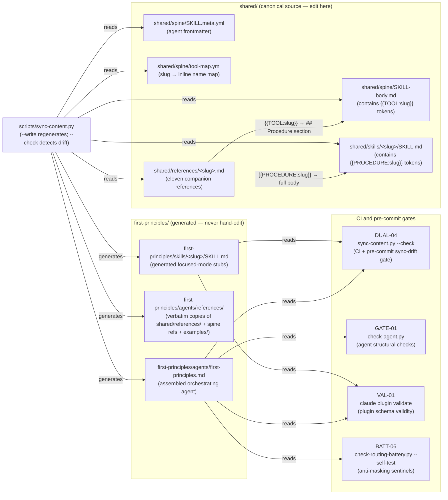
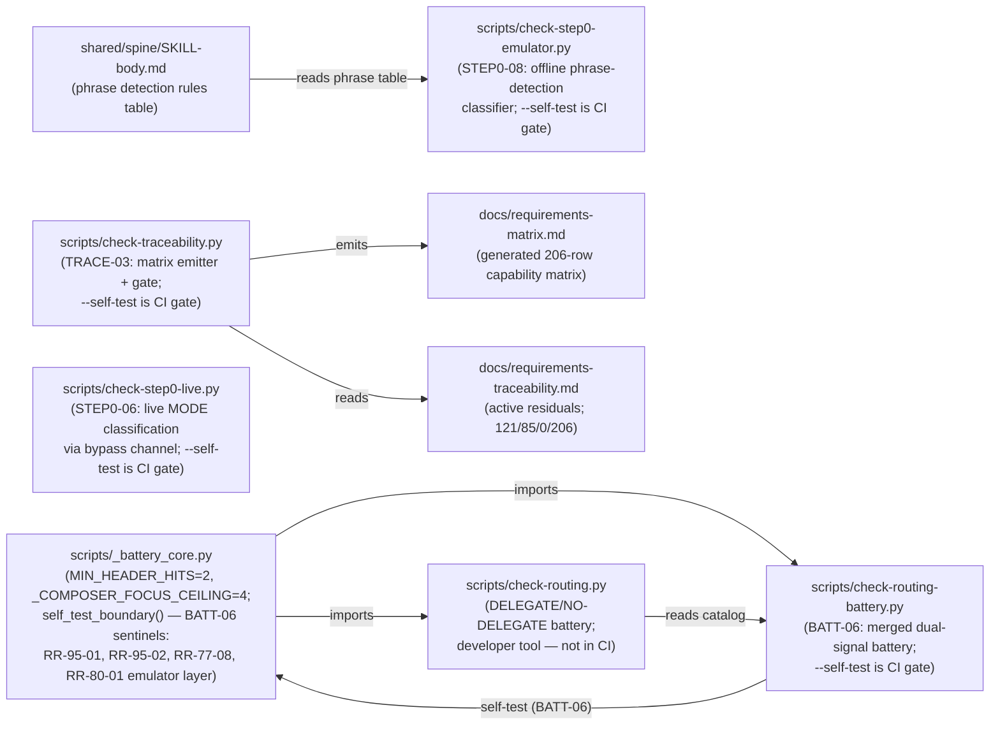

# Component Diagram

Two Mermaid diagrams at file/script node granularity: the **generation pipeline** and the
**measurement stack**. Each shows what reads what and what generates what. See also the
narrative in [DATA-FLOW.md](DATA-FLOW.md) and the canonical architecture reference in
[ARCHITECTURE.md](ARCHITECTURE.md).

---

## Diagram 1 — Generation pipeline

Source files in `shared/` flow through `scripts/sync-content.py` to produce the committed
`first-principles/` plugin tree, which is then verified by CI and pre-commit gates.
The non-obvious edges are the token-substitution reads: `{{TOOL:slug}}` pulls the
`## Procedure` section from `shared/references/<slug>.md` into the agent body; `{{PROCEDURE:slug}}`
pulls the full body of the same reference file into each focused-mode skill stub.

For the full 13-gate inventory (VAL-01 through TRACE-03 plus the two pre-commit gates) see
[ARCHITECTURE.md#ci-and-pre-commit-gate-inventory](ARCHITECTURE.md#ci-and-pre-commit-gate-inventory).
For the token-substitution mechanics see
[ARCHITECTURE.md#token-substitution](ARCHITECTURE.md#token-substitution).

---

## Diagram 2 — Measurement stack

`scripts/_battery_core.py` is the shared core. The scripts that sit above it exercise
different layers of routing and Step 0 correctness. `check-step0-emulator.py` reads the
phrase-detection table directly from the canonical source — the key cross-subsystem edge
connecting the measurement stack back to `shared/`.

For residual ownership details (which gate owns which RR-NN residual) see
[MEASUREMENT-MAP.md#residual-ownership](MEASUREMENT-MAP.md#residual-ownership).
For the anti-masking invariants and constant values see
[ARCHITECTURE.md#measurement-subsystem](ARCHITECTURE.md#measurement-subsystem).

---

## See also

- [ARCHITECTURE.md#generation-pipeline](ARCHITECTURE.md#generation-pipeline) — canonical assembly steps narrative
- [ARCHITECTURE.md#measurement-subsystem](ARCHITECTURE.md#measurement-subsystem) — measurement inventory at altitude
- [DATA-FLOW.md](DATA-FLOW.md) — narrative data-flow trace (Stage 1 through Stage 5)
- [MEASUREMENT-MAP.md](MEASUREMENT-MAP.md) — residual-ownership map (gate → RR-NN)
