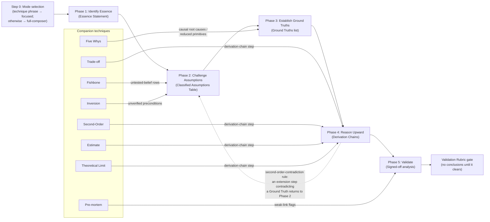

# The Five-Phase Flow

This diagram orients; the agent body (`first-principles/agents/first-principles.md`, sourced
from `shared/spine/SKILL-body.md`) is the authoritative spec. For the compact text form of the
same content see [METHODOLOGY-CHEATSHEET.md](METHODOLOGY-CHEATSHEET.md); for the system-level
generation-pipeline and measurement-stack diagrams see [COMPONENT-DIAGRAM.md](COMPONENT-DIAGRAM.md).

Scoped to `docs/` only — placement of this flow inside the agent body itself is byte-freeze,
permanently rejected scope.

## Legend

- **Solid edges** are hand-offs: a phase's named artifact becomes the entry condition for the
  next phase, or a companion technique's output feeds into the phase artifact it attaches to
  (e.g. Fishbone and Inversion feed rows into the Classified Assumptions Table).
- **The dotted edge** (Phase 4 → Phase 2) is the route-back: if a second-order extension step
  contradicts a Ground Truth, the conclusion returns to Phase 2 for re-challenging rather than
  proceeding to Phase 5 on a false premise.
- **The terminal rubric node** is a gate, not a hand-off: the Validation Rubric
  (`references/validation-rubric.md`) must clear before conclusions are presented — validate,
  fix, and repeat until every criterion passes.
