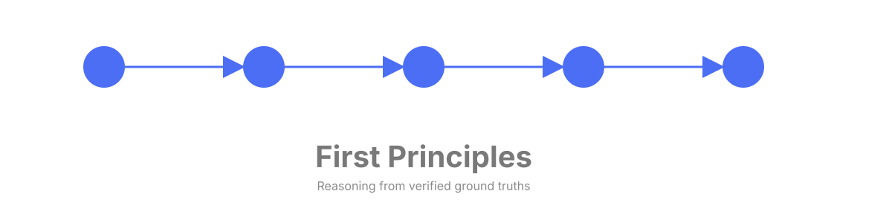

# docs/ — Documentation Index

> **Final state — start here:** [`v8.0-final-closure.md`](v8.0-final-closure.md) — terminal
> release record, accepted limitations, final coverage headline (133/96/0/229), and deferred-ledger
> disposition summary.
>
> Later milestones v8.1 (a Grok-review triage that selectively implemented 7 docs/metadata items), v8.2 (a fresh analysis-only re-investigation of the 19 not-approved items), v8.3 (a technique-overlap + context-optimization evaluation, findings-only, byte-freeze untouched), and v8.4 (an implementation-readiness evaluation that returned a GO verdict on the GROK-04 hero banner — specified and costed but deliberately not built, awaiting a future milestone — and a NO-GO on reference-file extraction) left this terminal baseline unchanged.

Milestone v8.5 (Context Optimization — Execute the Reference-File Split) is the first implementation + live milestone since v8.1: it executed the 4-file reference split (five-whys, theoretical-limit, estimate, fishbone into core + on-demand `-detail.md` siblings, dropping 398 lines off the skill surface) and ran the milestone's only live spend — a 72-call re-measure — narrowly relaxing the byte-freeze to re-open and re-measure exactly RR-108-04/RR-108-05, unlike the v8.2–v8.4 analysis-only milestones. The detector constants stayed byte-unchanged and the coverage headline stayed 133/96/0/229.

Milestone v8.6 (Agent-Body Procedure Compression) is the second consecutive live-measure milestone: it compressed the always-loaded, auto-routed agent body's inlined `## Procedure` prose for four techniques — estimate and theoretical-limit (no emission detector, zero measured-floor risk) and five-whys and fishbone (marker-pinned) — cutting the agent body 612 to 590 lines, the surface v8.5's reference-file split structurally could not shrink, since the agent body inlines only `## Procedure`. It then ran a small 2-row live Step-0 re-measure confirming neither compressed detector-covered row regressed (fishbone 3/5 to 4/5, five-whys 0/5 to 2/5 unbanked). The detector constants and the coverage headline stayed unchanged (133/96/0/229).

Milestone v8.7 (Analysis Correctness, Constraint Teardown & Output-Contract Integrity) breaks the pattern of every milestone since v8.1 — its scope traces to a v8.6 post-hoc finding and a fresh constraint audit, not to the prior milestone's own optimization paperwork, and for the first time in 161 phases an instrument asked whether the agent's analyses are actually *correct* rather than merely well-formed. The correctness spot-check (Phase 162) re-derived 65 load-bearing claims across six frozen analyses — 47 correct / 6 wrong / 12 unverifiable, zero material errors, milestone proceeds — but surfaced the more consequential finding: rubric conformance does not predict arithmetic correctness (the most accurate document failed the rubric; the least accurate passed). Constraint teardown (Phase 163) then retired five carried constraints on that evidence: the 644-line body-budget gate, the `_COMPOSER_FOCUS_CEILING=4` freeze, K-of-5 Step 0 as a phase gate, the blanket gitignored-planning posture, and the `phases.clear`-stays-OFF workaround. Harness promotion (Phase 164) turned the throwaway blind A/B rig into a permanent, self-testing `scripts/check-quality-harness.py` instrument (`QUAL-01`, battery 15 to 16) and froze a pre-fix quality baseline as committed evidence. The output-contract fix (Phase 165) then landed chain-form conversion, a §6→§4 closure check, and a Verdict-token prefix format — five behavior-changing consistency fixes, shipped without a live re-measure of Step 0 or routing (an explicitly accepted caveat). The post-fix blind re-measure (Phase 166) returned an honest **MIXED** verdict: the untraced-defect incidence held flat at 6/6, chain-defect incidence improved 6/6 to 4/6, and the aggregate +9 band delta shrank to roughly +3 once drift noise was controlled for — the real signal is the chain-rigor improvement, not the aggregate. Closure reconcile (Phase 167) indexes these four documents, brings `CLAUDE.md` and `docs/TESTING.md` to the same terminal shape every prior milestone reached, and stages the honest-MIXED `v8.7` tag message — and folds in the seven deferred Phase-165 code-review fixes (five of them behavior-changing), applied *after* the Phase-166 measurement above and deliberately not re-measured, so the shipped v8.7 contract differs from the one that verdict measured (stated plainly, honesty-not-score — the before/after of those five fixes is left to a future self-measuring follow-up).

Milestone v8.9 (DIAGNOSE-01) is the first `docs/`-shipping milestone since v8.7 — the intervening v8.8 was a doc-only technical-debt and framing-correction milestone that added no new `docs/` file — and it diagnoses, rather than fixes, why v8.7's §6→§4 output-contract fix left the untraced-defect incidence flat at 6/6: a pre-registered blind hand-read of all six frozen post-fix analyses, reconciled against the machine detector, found the flat flag is driven by three isolated `scripts/check-quality-harness.py` extraction limitations, not an agent-reasoning gap — adopted verdict **MEASUREMENT** (6/6), with the fragility disclosed directly alongside it: the verdict rides on one post-hoc claim-scoping reading and flips to **MECHANISM** (5/6) under the alternate every-extracted-sentence reading. The recommendation is costed for a future FIX-CONTRACT-01 offline detector fix (no prompt re-attempt — the lever is the detector, not the prompt); the detector constants and the coverage headline stayed byte-unchanged (132/97/0/229, the value since v8.8's post-close re-tier).

Milestone v8.10 (CORRECTGATE-01) validated FIX-CONTRACT-01 out-of-sample on six fresh problems and found it **DIVERGES**: under the `declarative-only` reading the aggregate is measurement-signal (4/6, FIX-CONTRACT-01 **stands**), while under the `every-extracted-sentence` reading it is mechanism-signal (5/6, FIX-CONTRACT-01 **must-revisit**) — and `Q-N4` is untraced under **both** readings, independent of the reading fork (its §6 conclusion never cites a chain id, only assumption-table ids). Only from that measured DIVERGE does the milestone then *design* — not build — a correctness instrument: a support-adequacy triad (present ∧ valid ∧ non-vacuous) that resolves the reading fork by defining the load-bearing claim itself, plus a committed acceptance/falsification fixture manifest (50%-arithmetic doc → FAIL, 100%-arithmetic doc → PASS, META-Q4 vacuous-green → FLAG, `Q-N4` → FAIL, the other five fresh documents → PASS). Building and wiring that instrument into the offline battery is the named out-of-scope downstream successor, **`CGATE-BUILD-01`**. The coverage headline stayed 132/97/0/229 and byte-freeze held.

This folder documents the first-principles plugin system. New here? Start with [GETTING-STARTED.md](GETTING-STARTED.md), then [ONBOARDING.md](ONBOARDING.md), then [DATA-FLOW.md](DATA-FLOW.md).

---

## Core docs

| Document | What it covers |
|----------|----------------|
| [ARCHITECTURE.md](ARCHITECTURE.md) | System architecture: `shared/` → generation pipeline, plugin layout, five-phase agent methodology, measurement subsystem, CI + pre-commit gate table |
| [CONFIGURATION.md](CONFIGURATION.md) | Skill frontmatter rules, version-string format, reserved words, anti-masking invariants (`MIN_HEADER_HITS=2`, `_COMPOSER_FOCUS_CEILING=4`) |
| [DEVELOPMENT.md](DEVELOPMENT.md) | Contributor workflow: `shared/` source-of-truth model, validation-script inventory, standard editing loop, pre-commit hook setup, key invariants |
| [FIVE-PHASE-FLOW.md](FIVE-PHASE-FLOW.md) | Mermaid flow diagram of the 5-phase methodology: Step 0 mode selection, phase chain with named artifacts, companion-technique handoff edges, and the second-order route-back |
| [GETTING-STARTED.md](GETTING-STARTED.md) | Install the plugin, invoke the agent and thirteen companion skills, slash invocation |
| [METHODOLOGY-CHEATSHEET.md](METHODOLOGY-CHEATSHEET.md) | One-page quick reference: the 5-phase flow, named artifacts, assumption types, derivation-chain format, and all 13 companion/focused skills with slash commands |
| [TESTING.md](TESTING.md) | How to run every CI gate and the two pre-commit gates — VAL/DUAL/GATE/STEP0/BATT/TRACE matrix, each mapped to its script |
| [testing-agents-headlessly.md](testing-agents-headlessly.md) | Headless testing: routing battery, two-layer Step 0 harness, `stream-json` capture |

## System-connection docs

| Document | What it covers |
|----------|----------------|
| [DATA-FLOW.md](DATA-FLOW.md) | End-to-end trace: `shared/` source edit → `sync-content.py` → generated plugin → CI gates → measurement harness |
| [MEASUREMENT-MAP.md](MEASUREMENT-MAP.md) | Layered test stack: routing battery ↔ Step 0 emulator ↔ Step 0 live ↔ traceability matrix ↔ BATT-06 sentinels; which gate owns which residual |
| [COMPONENT-DIAGRAM.md](COMPONENT-DIAGRAM.md) | Mermaid diagrams of the generation pipeline and measurement stack — what reads what, what generates what |
| [ONBOARDING.md](ONBOARDING.md) | Contributor on-ramp: end-to-end "make a change" walkthrough from `shared/` edit to shipped, gated plugin artifact |

## Requirements & traceability

| Document | What it covers |
|----------|----------------|
| [v8.0-final-closure.md](v8.0-final-closure.md) | **Terminal record** — final baselines, accepted limitations, coverage headline, deferred-ledger disposition summary |
| [requirements-traceability.md](requirements-traceability.md) | Authoritative requirements traceability surface: active residuals, coverage headline, compact historical ledger, gap findings |
| [requirements-matrix.md](requirements-matrix.md) | Generated 229-row capability → requirement → test matrix |
| [v8.1-grok-review-assessment.md](v8.1-grok-review-assessment.md) | Rated inventory of external-review (Grok) recommendations: 26 itemized GROK-NN rows with invasiveness score, already-done verification, verdict, effort estimate; SELECT-01 dispositions recorded (7 approved / 19 not approved, Phase 144) |
| [v8.2-grok-reassessment.md](v8.2-grok-reassessment.md) | Fresh re-investigation of the 19 not-approved items; 18 keep-won't-do / 1 promote-candidate (GROK-04 hero banner) — non-binding input to a future milestone decision |

## Optimization studies

| Document | What it covers |
|----------|----------------|
| [v8.3-technique-context-optimization-eval.md](v8.3-technique-context-optimization-eval.md) | Per-technique overlap map (8 techniques), agent-body line accounting, composer-vs-pull-when-needed trade-off, and a prioritized optimization plan — findings-only, no `shared/` change. |
| [v8.4-implementation-readiness-eval.md](v8.4-implementation-readiness-eval.md) | Go/no-go verdicts + costed implementation-readiness plans for the GROK-04 hero banner (GO) and on-demand reference-file extraction (NO-GO) — neither built. |

## v8.5 — Context optimization (reference-file split)

| Document | What it covers |
|----------|----------------|
| [v8.5-byte-freeze-relaxation.md](v8.5-byte-freeze-relaxation.md) | Governing record narrowly re-opening RR-108-04/RR-108-05's re-measure disposition + the 4 split files' content; all other frozen constants keep gating. |
| [v8.5-split-measurement.md](v8.5-split-measurement.md) | Split verification measurement (SPLIT-02/03): skill surface −398 lines, agent body +14 (cost-of-mechanism), full offline battery green; body was 612 lines at the time of this frozen measurement (the 644 figure it was checked against was later retired as a live gate — TEARDOWN-01, v8.7-constraint-teardown.md). |
| [v8.5-live-remeasure-verdict.md](v8.5-live-remeasure-verdict.md) | Live 72-call re-measure honest verdict (MEASURE-03): five per-row floor judgments, fishbone 3/5 CLOSE, S-P02/S-P10/S-P14 CARRY, D-05 fired-set diff, run economics. |

## v8.6 — Agent-body procedure compression

| Document | What it covers |
|----------|----------------|
| [v8.6-measured-reduction.md](v8.6-measured-reduction.md) | Re-derived per-technique + headline agent-body line reduction (COMPRESS-01/02/03) — assembled agent body 612 to 590 lines (-22), estimate / theoretical-limit / five-whys / fishbone Procedure-slice word-count deltas, offline battery re-proof. |
| [v8.6-live-remeasure-verdict.md](v8.6-live-remeasure-verdict.md) | Live 2-row Step-0 re-measure honest verdict (MEASURE-01/02) — S-P03 fishbone 4/5 SUSTAINED (+1), S-P04 five-whys 2/5 SUSTAINED (+2, unbanked), D-05 fired-set / composer-ceiling provenance trace, RR-117-01 re-point to `_load_excerpt_v86`. |
| [v8.6-quality-ab-experiment.md](v8.6-quality-ab-experiment.md) | Post-hoc blind A/B of analysis *quality* at 590 vs 612 body lines, scored by 6 independent blinded judges against the validation rubric — no detectable difference (both arms 2/3 PASS, band total 35/35); failures track the problem, not the arm. Also reports the rubric's 2-level effective range and four reproducible output-contract defects. |

## v8.7 — Analysis correctness, constraint teardown & output-contract integrity

| Document | What it covers |
|----------|----------------|
| [v8.7-correctness-spot-check.md](v8.7-correctness-spot-check.md) | Zero-spend re-derivation of 65 load-bearing quantitative claims across the six frozen v8.6 analyses (CORRECT-01/02) — 47 correct / 6 wrong / 12 unverifiable, 0 material errors; the separate finding that rubric conformance does not predict arithmetic correctness. |
| [v8.7-constraint-teardown.md](v8.7-constraint-teardown.md) | Standing governing record (TEARDOWN-01/02/03) retiring five carried constraints — the body-budget gate, the `_COMPOSER_FOCUS_CEILING=4` freeze, K-of-5 Step 0 as a phase gate, the blanket gitignored-planning posture, and the `phases.clear`-stays-OFF workaround — against the four that survived the audit. |
| [v8.7-quality-baseline-freeze.md](v8.7-quality-baseline-freeze.md) | Phase 164 write-up (HARNESS-01): promotes the blind A/B rig to the permanent, self-testing `scripts/check-quality-harness.py` instrument (`QUAL-01`, battery 15→16) and freezes the pre-fix quality baseline as committed evidence. |
| [v8.7-post-fix-remeasure.md](v8.7-post-fix-remeasure.md) | Phase 166 honest MIXED verdict (MEASURE-01): the output-contract fix left untraced-defect incidence flat (6/6), improved chain-defect incidence (6/6→4/6), and moved the aggregate band total +9 (to roughly +3 once drift noise is controlled for) — plus the three-way comparison-basis conflict flagged for Phase 167. |

## v8.9 — DIAGNOSE-01

| Document | What it covers |
|----------|----------------|
| [v8.9-diagnose-contract-fix.md](v8.9-diagnose-contract-fix.md) | DIAG-01→DIAG-04 diagnosis of v8.7's flat 6/6 untraced-§6 defect: pre-registered protocol, blind hand-read of all six frozen post-fix analyses, reconciliation against the machine detector, and the adopted verdict = **MEASUREMENT** — all six documents traced their conclusion claims; the flag is driven by three isolated `scripts/check-quality-harness.py` extraction limitations, costed for the downstream **FIX-CONTRACT-01** offline detector fix (no prompt re-attempt). Fragility disclosed: the verdict rides on one post-hoc declarative-only reading and flips to **MECHANISM 5/6** under the alternate every-extracted-sentence reading. |

## v8.10 — CORRECTGATE-01

| Document | What it covers |
|----------|----------------|
| [v8.10-fix-contract-oos-protocol.md](v8.10-fix-contract-oos-protocol.md) | Phase 173 pre-registered out-of-sample protocol — the evidence/form/detector-judging criteria, the per-doc reduction rule, the verdict rule, and the two reading positions (`declarative-only` / `every-extracted-sentence`) fixed *before* any fresh analysis was hand-read. |
| [v8.10-fix-contract-oos-validation.md](v8.10-fix-contract-oos-validation.md) | Phase 173 CGATE-02 blind hand-read of six fresh out-of-sample analyses (committed before any detector output existed) + CGATE-03 detector reconciliation, landing the **FIX-CONTRACT-01 = DIVERGE** disposition — `declarative-only` 4/6 stands, `every-extracted-sentence` 5/6 must-revisit, `Q-N4` untraced under both readings. |
| [v8.10-correctness-instrument-design.md](v8.10-correctness-instrument-design.md) | Phase 174 design-only spec (CGATE-04/CGATE-05): the support-adequacy triad (present ∧ valid ∧ non-vacuous), the one-instrument/three-DIVERGE unification, the load-bearing-claim definition that resolves the reading fork, and the committed acceptance/falsification fixture manifest. Names **`CGATE-BUILD-01`** — building and wiring the instrument into the offline battery — as the explicit out-of-scope downstream successor; nothing is built in this milestone. |

## Reference & history

| Document | What it covers |
|----------|----------------|
| [gen-01-decision.md](gen-01-decision.md) | ADR: the original GEN-01 generation-pipeline decision |
| [gen-01-rearch-milestone.md](gen-01-rearch-milestone.md) | ADR: the GEN-01 rearchitecture milestone record |
| [live-monitoring-runbook.md](live-monitoring-runbook.md) | Runbook for live routing-battery and Step 0 monitoring runs |
| [history/](history/) | Frozen per-milestone snapshots (REQUIREMENTS, ROADMAP, MILESTONE-AUDIT) — immutable archives |
